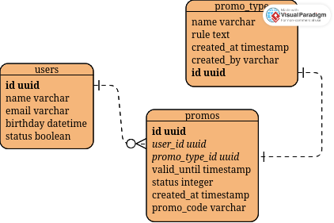

# Sayakaya Promo Engine

Welcome! Selamat Datang! ようこそ!

This Repository contains the sayakaya's birthday promo engine. This engine will

1. Run everyday at specified time 🌞
2. Check if there's any birthday 🥳 in the current date inside the databases
3. Create a promo code that's only valid for that day for the birthday boi. Yeahh 🎊 🎂
4. Send the happy message ✉️  to the birthday boii 🥳

Now let's get serious and talk about how this engine can run 😎

This engine have two parts :

1. a scheduler, built in rust
2. a promo service, built in Golang

The reason why i choose this design is to prevent single point of failure and create some flexibility in triggering the generating process of said promos.
By this design the part that run at specific time everyday, check the db for users with birthday is in the [scheduler](./scheduler/) and the part where new promo are created, stored, and sent 
is in the [promo's service](./promos/)

## Design Choice

For this project i've been designed the ERD and flowchart that can explained simply how the system works,

### Flowchart
 

### ERD
 

## How to Run this engine

You can run this engine by first starting the database (postgresql) and message queue (Redis PubSub) first

```bash
docker-compose up -d
```

and then, you need to set up .env for both in the rust and Go project.

After that run both of the services and voila!

Thank you!! ありがとうございます！！！🙏
